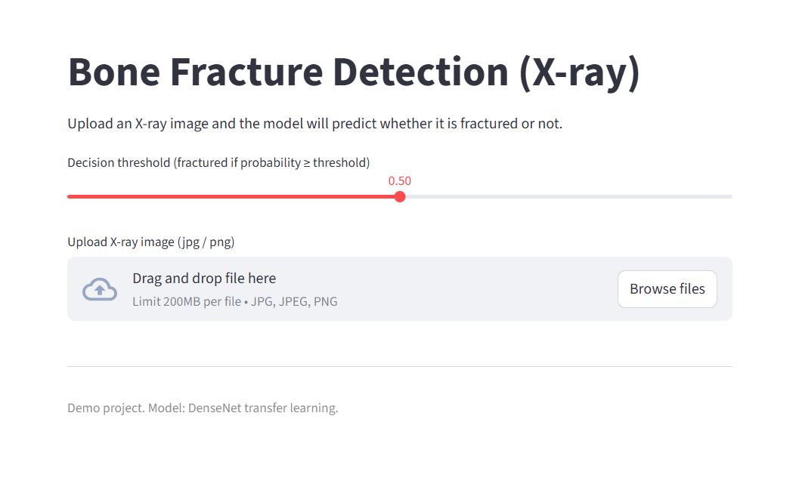
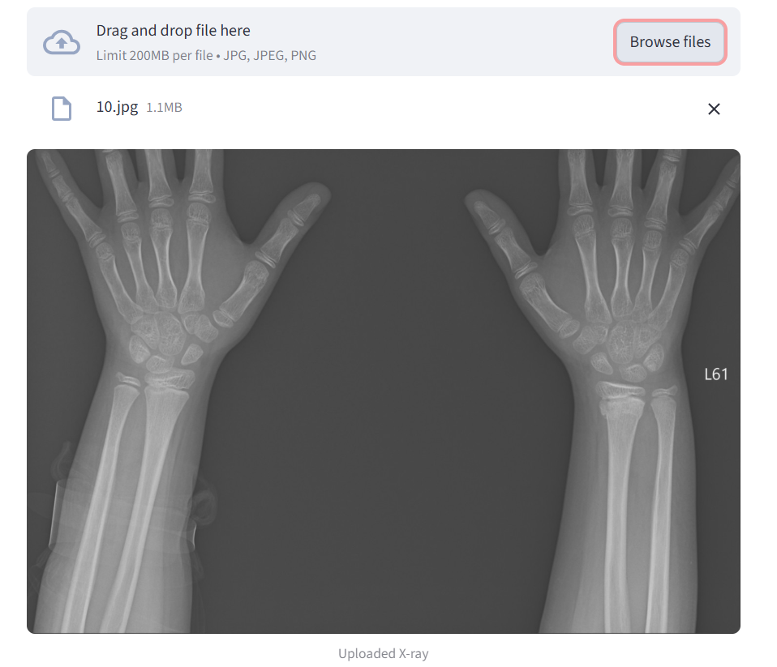
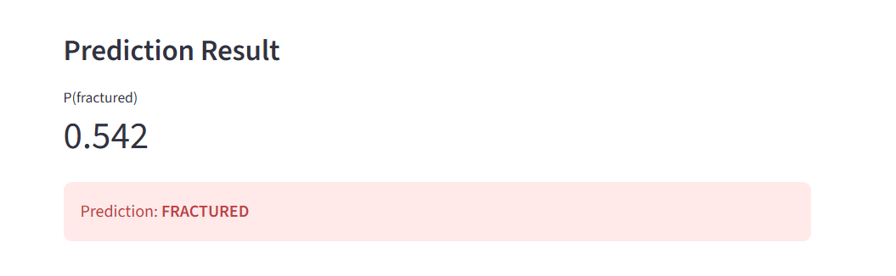

# 🦴 Bone Fracture Detection using Deep Learning

A deep learning project that detects **bone fractures from X-ray images** using transfer learning with DenseNet121.

This project includes:
- Model training in TensorFlow/Keras
- Transfer learning with DenseNet
- Validation metrics (AUC, accuracy, precision, recall)
- Interactive Streamlit web app for predictions

---

##  Demo

### Upload Interface




### Prediction Example



---

##  Model Performance (Validation Set)

- **ROC-AUC:** ~0.88  
- **Accuracy:** ~80%  
- **Fracture Recall (Sensitivity):** ~80%  
- **Fracture Precision:** ~86%  

These results show the model can reliably detect fractures while maintaining reasonable precision.

---

##  Model Details

- Backbone: **DenseNet121 (ImageNet pretrained)**
- Input size: 224 × 224
- Binary classification:
  - 1 = Fractured
  - 0 = Not Fractured
- Loss: Binary Crossentropy
- Optimizer: Adam
- Fine-tuning of last DenseNet layers

---

##  Streamlit Demo App

Users can:
- Upload an X-ray image
- Adjust decision threshold
- View fracture probability
- Get instant prediction

---

## ▶ How to Run Locally

### 1. Clone repo

```bash
git clone https://github.com/<your-username>/bone-fracture-detection.git
cd bone-fracture-detection
